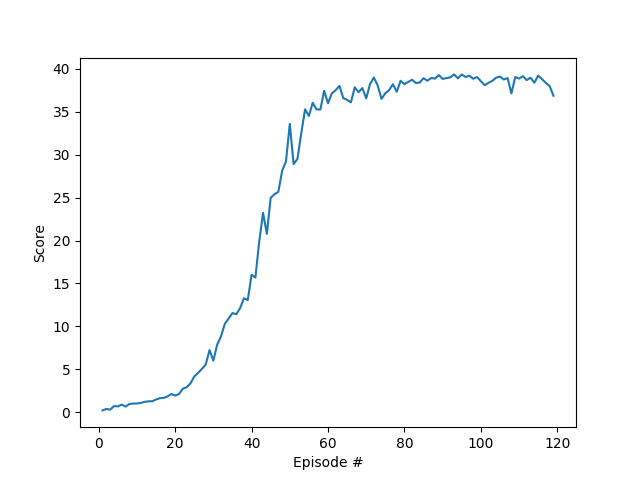

# Project report

## Learning algorithm

The learning algorithm used in this project is Deep Deterministic Policy Gradients (DDPG) outlined in this [research paper](https://arxiv.org/pdf/1509.02971.pdf) by Google Deepmind. It is described as "an actor-critic, model-free algorithm based on the deterministic policy gradient that can operate over continuous action spaces."

This algorithm fits into a category of RL algorithms called Actor Critics. These algorithms are so called because they train 2 neural networks, the actor which is policy-based and the critic which is value-based. As a result Actor Critic agents get the best of both worlds - they are more stable than value-based agents and need fewer samples than policy-based agents.

DDPG is so called because the actor network is used to approximate the optimal policy deterministically. This means it will always output the best believed action for any given state, unlike stochastic policies which learn a probability distribution of all actions.

It is also worth nothing that DDPG uses soft updating, meaning the values are slowly blended from the regular network where training occurs, to the target network which is used for prediction. This happens for both the actor and the critic.

## Implementation

#### Model architecture for the neural network:
Actor
- input: 33, output: 128 (ReLu activation)
- input: 128, output: 128 (ReLu activation)
- input: 128, output: 4 (tanh activation)
        
Critic
- input: 33, output: 128 (ReLu activation)
- input: 128+4, output: 128 (ReLu activation)
- input: 128, output: 1 (No activation) 

#### Steps taken to generate the final network:

- Adapted existing DDPG implementation to add multiple agents experiences to the replay buffer
- Sampled 10 times from the replay buffer every 20 timesteps
- Added gradient clipping to the Critic
- Reduced the Actor/Critic node size to 128
- Tweaked Actor/Critic learning rates to get optimal results
- Tweaked the Sigma value which controls the volatility of Ornstein-Uhlenbeck noise

#### Hyperparameters used in the final training solution:

buffer_size = int(1e6)  
batch_size = 128  
gamma = 0.99  
tau = 1e-3  
lr_actor = 3e-4  
lr_critic = 3e-4  
weight_decay = 0  
learn_every = 20  
learn_sample = 10  
sigma = 0.1  
theta = 0.15 

## Results

Episode 100 Mean: 13.15  
Episode 151	Mean: 38.63  
Environment solved in 51 episodes!	Average score: 30.07  

## Ideas for future work

- Investigate methods to improve the accuracy and speed of the current implementation, such batch normalization or prioritized experience replay.

- Investigate some of the algorithms than can gather experience from multiple agents in parallel such as PPO, A3C or D4PG.
